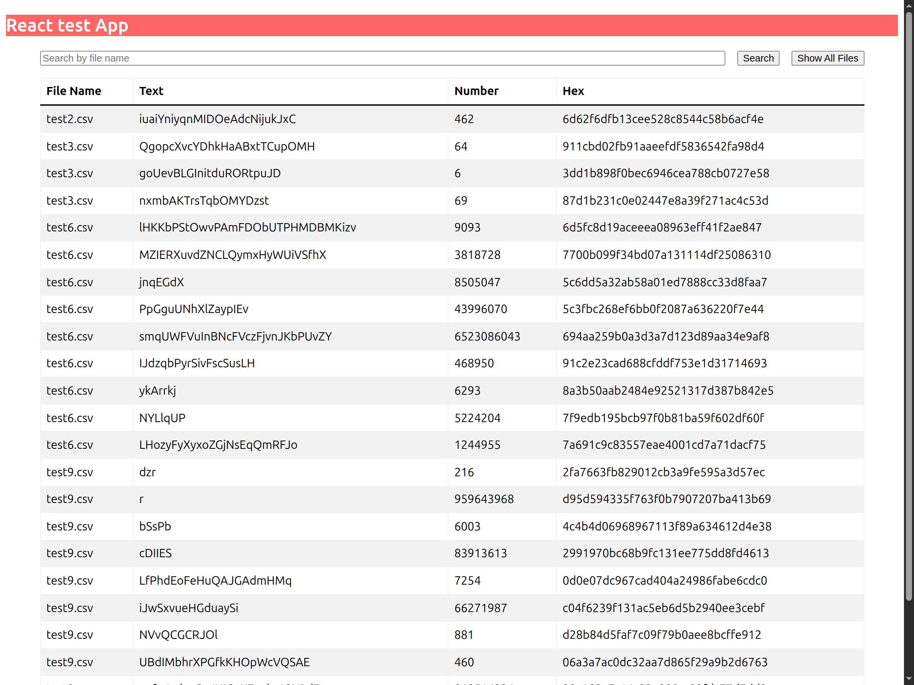

# Monorepo: Express + React

A monorepo setup using **Express.js** for the backend and **React** with **Vite** for the frontend. This project demonstrates a simple full-stack application with a focus on best practices, modularity, and modern JavaScript tooling.


## Description

This project is structured as a **monorepo**, containing two main packages:

```markdown
## Project Structure
packages/
├── api/           # Backend Express.js application
│   ├── src/       # Source files
│   └── tests/     # API tests
└── ui/            # Frontend React application
    └── src/       # React components and logic
    └── tests/     # Frontend tests
```

## Demo



The API fetches data from an external service, processes it, and makes it available for the frontend, which displays the data in a clean, user-friendly manner.

## Requirements

- **Node.js**: v18 or higher
- **pnpm**: Latest stable version recommended

## Quick Start
```bash
git clone git@github.com:galiprandi/monorepo-express-react.git
cd monorepo-express-react
pnpm install
pnpm dev
```

## API Routes

### Health Check
- `GET /health`
  - Returns server health status

### File Operations
- `GET /files/data`
  - Returns data of files
  - Query Parameters:
    - `fileName` (optional): Specific file name (e.g., file.csv)
    - If no fileName is provided, returns data for all files

- `GET /files/list`
  - Returns a list of all available file names

## Installation

To get started with this project, follow these steps.

1. **Clone the repository:**

   ```bash
   git clone git@github.com:galiprandi/monorepo-express-react.git
   cd monorepo-express-react
   ```

2. **Install dependencies:**

   Since this is a monorepo, you need to install dependencies for all workspaces:

   ```bash
   pnpm install
   ```

## Development

To start both the frontend and backend in development mode:

1. **Start the development servers:**

   ```bash
   pnpm dev
   ```

   This will:
   - Start the **API** on `http://localhost:3000`.
   - Start the **Frontend** on `http://localhost:8000`.

   Both services will run concurrently in development mode with **hot reloading** enabled.

## Available Scripts

The project uses pnpm for package management and includes the following scripts:

### Development
- `pnpm dev`
  - Runs all packages in development mode simultaneously
  - Starts the API server on port 3000
  - Launches the frontend dev server on port 8000
  - Enables hot reloading for both services

### Production
- `pnpm start`
  - Launches all packages in production mode
  - Requires running `pnpm build` first for the frontend
  - Optimized for performance and production environment

### Building
- `pnpm build`
  - Builds all packages for production
  - Creates optimized frontend bundle using Vite
  - Generates static assets in the `dist` directory

### Testing
- `pnpm test`
  - Executes test suites across all packages
  - Runs in parallel for faster execution
  - Includes unit and integration tests

### Code Quality
- `pnpm lint`
  - Runs StandardJS linter across all packages
  - Checks code style and formatting
  - Identifies potential errors and inconsistencies

### Setup
- `pnpm prepare`
  - Installs and configures Husky git hooks
  - Sets up pre-push test validation
  - Required after initial clone or Husky updates

### Workspace Commands
All commands can be run for specific packages using the filter flag:
```bash
pnpm --filter=@package-name command
```

## Dependencies

- **Express.js**: Backend framework for building RESTful APIs.
- **React**: Frontend framework for building user interfaces.
- **Vite**: Fast build tool for modern web development.
- **StandardJS**: JavaScript style guide, linter, and formatter.


## Author
- **Name**: Germán Aliprandi
- **Website**: [https://galiprandi.github.io/me/ext/](https://galiprandi.github.io/me/ext/)

## License

This project is licensed under the **MIT License** - see the [LICENSE](LICENSE) file for details.